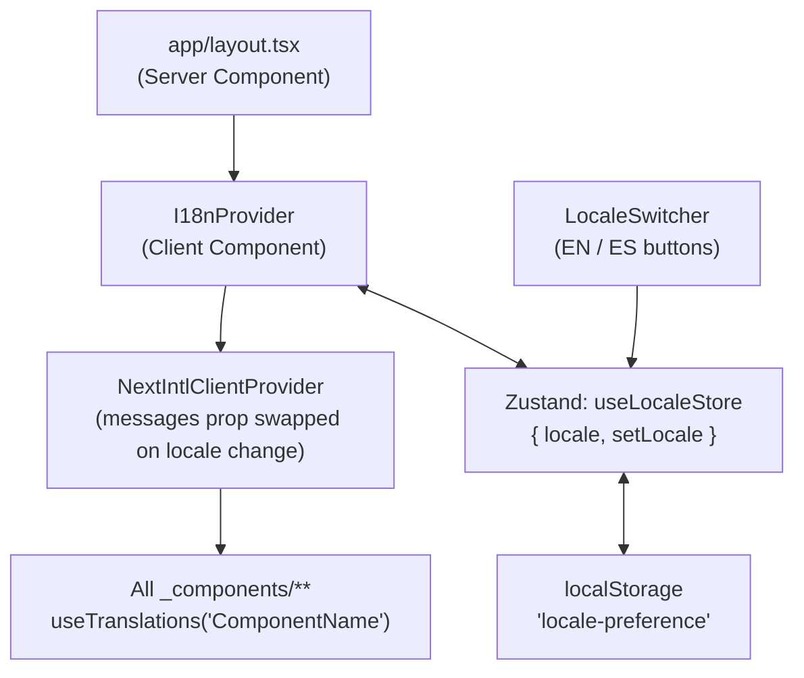

# i18n Plan: English + Spanish

## Overview

Add English/Spanish internationalization to the Minecraft Pixel Art Generator as a purely client-side locale switch (no page reload, no URL change) using next-intl in "without routing" mode and JSON message files stored in the repo.

---

## String Inventory

The app has ~100 UI strings spread across:
- [`app/page.tsx`](app/page.tsx) — header, steps, sidebar labels, errors (~40 strings)
- [`app/_components/ControlPanel.tsx`](app/_components/ControlPanel.tsx) — dimensions, orientation, categories (~15)
- [`app/_components/PixelArtPreview.tsx`](app/_components/PixelArtPreview.tsx) — toolbar, tooltips, modes (~20)
- [`app/_components/BlockLegend.tsx`](app/_components/BlockLegend.tsx) — CSV export, block counts (~5)
- [`app/_components/BlockPickerModal.tsx`](app/_components/BlockPickerModal.tsx) — search, categories (~5)
- [`app/_components/SchematicViewer3D.tsx`](app/_components/SchematicViewer3D.tsx) — layer modes, controls hint (~10)
- [`app/_components/ImageUpload.tsx`](app/_components/ImageUpload.tsx), [`ThemeToggle.tsx`](app/_components/ThemeToggle.tsx) (~5)
- [`app/layout.tsx`](app/layout.tsx) — `<title>`, `<meta description>`, `lang` attribute

Block names in [`app/_lib/blocks.ts`](app/_lib/blocks.ts) (1000+ entries) are a separate concern — Minecraft has official locale files (`.lang`/`.json` in game JARs) that can be used for Spanish block name translations, deferred to a later milestone.

---

## Option A: JSON files in this repository

**Pros:**
- Zero external dependency and zero cost
- Full Git history on every string change — translations are reviewed in PRs like code
- Works offline and in CI without API keys
- Sufficient for 2 locales and ~100 strings
- Aligns with the existing codebase ethos (no external services beyond Vercel)
- Translation changes can't break the build from an upstream outage

**Cons:**
- No collaboration UI for non-technical translators
- Manual process: add a key in code, add the string in both JSON files
- No translation memory, glossary, or machine translation suggestions
- Harder to scale if you later add 5+ languages

## Option B: Third-party translation service (Lokalise, Phrase, Crowdin, Transifex)

**Pros:**
- Web UI for translators (non-developers can contribute)
- Translation memory, glossary, auto-suggestions
- GitHub sync webhooks — push key changes automatically
- Scales easily to many languages

**Cons:**
- Cost: free tiers are limited; ongoing subscription for team use
- External dependency in CI/CD (sync step needed on every build or PR)
- Overkill for 2 languages and ~100 strings
- Vendor lock-in; migration later is painful
- Keys still live in code, so a developer must add them first anyway

**Recommendation: Option A (JSON in repo).** The project is a single-page tool with a small, stable string set and only 2 target locales. The overhead of a third-party service outweighs the benefits at this scale. If the project grows beyond ~4 languages or gains non-developer translators, migrating the JSON files into a service is straightforward.

---

## Technology: `next-intl` (without i18n routing)

`next-intl` supports a ["without i18n routing"](https://next-intl.dev/docs/getting-started/app-router/without-i18n-routing) mode — no `[locale]` URL segment, no `middleware.ts`. The library is the de-facto standard for Next.js App Router, provides TypeScript-safe keys, pluralization, and number/date formatting with locale awareness.

This satisfies the **no page refresh** requirement: locale is stored in `localStorage` and in a Zustand store. Changing the locale re-renders the `NextIntlClientProvider` with the new messages — no navigation, no reload.

---

## Architecture



- `I18nProvider` is a thin client wrapper that reads `locale-preference` from `localStorage` on mount (matching the existing theme anti-flash pattern), initializes Zustand, and renders `NextIntlClientProvider` with the matching message bundle.
- Both `en.json` and `es.json` are imported statically (they are tiny), so no async fetch is needed on locale switch — the swap is synchronous.
- `LocaleSwitcher` lives in the page header next to `ThemeToggle`.

---

## New Files

- `messages/en.json` — all English strings, namespaced by component
- `messages/es.json` — all Spanish strings, same structure
- `app/_lib/i18n.ts` — next-intl config (locale list, default locale)
- `app/_components/I18nProvider.tsx` — client wrapper (Zustand init + NextIntlClientProvider)
- `app/_components/LocaleSwitcher.tsx` — EN/ES toggle (mirrors ThemeToggle pattern)

---

## Changed Files

- [`app/layout.tsx`](app/layout.tsx) — wrap children with `I18nProvider`; make `lang` attribute dynamic
- [`app/page.tsx`](app/page.tsx) — add `useTranslations('Page')`, replace ~40 hardcoded strings
- [`app/_components/ControlPanel.tsx`](app/_components/ControlPanel.tsx) — `useTranslations('ControlPanel')`
- [`app/_components/PixelArtPreview.tsx`](app/_components/PixelArtPreview.tsx) — `useTranslations('PixelArtPreview')`
- [`app/_components/BlockLegend.tsx`](app/_components/BlockLegend.tsx) — `useTranslations('BlockLegend')`
- [`app/_components/BlockPickerModal.tsx`](app/_components/BlockPickerModal.tsx) — `useTranslations('BlockPickerModal')`
- [`app/_components/SchematicViewer3D.tsx`](app/_components/SchematicViewer3D.tsx) — `useTranslations('SchematicViewer3D')`
- [`app/_components/ImageUpload.tsx`](app/_components/ImageUpload.tsx) — `useTranslations('ImageUpload')`
- [`app/_components/ThemeToggle.tsx`](app/_components/ThemeToggle.tsx) — `useTranslations('ThemeToggle')`

---

## Message File Shape

```json
// messages/en.json
{
  "Page": {
    "title": "Minecraft Pixel Art Generator",
    "tagline": "Image → Litematica schematic",
    "stepUpload": "Upload image",
    "stepConfigure": "Configure",
    "stepGenerate": "Generate",
    "stepDownload": "Download",
    "errorNoBlocks": "No blocks available. Select at least one category.",
    "downloadButton": "Download .litematic"
  },
  "ControlPanel": {
    "dimensionsLabel": "Dimensions (blocks)",
    "widthLabel": "Width",
    "heightLabel": "Height",
    "totalBlocks": "Total: {count} blocks",
    "generateButton": "Generate Pixel Art"
  }
}
```

---

## Implementation Steps

1. **Install `next-intl`** — `pnpm add next-intl zustand`; confirm `next.config.ts` needs no plugin in without-routing mode
2. **Create message files** — audit all hardcoded strings; write `messages/en.json` and `messages/es.json` with namespaced keys
3. **Create `app/_lib/i18n.ts`** — export locale union type, default locale, static imports of both bundles
4. **Create `app/_components/I18nProvider.tsx`** — Zustand store + localStorage persistence + `NextIntlClientProvider` wrapper
5. **Create `app/_components/LocaleSwitcher.tsx`** — EN/ES toggle mirroring `ThemeToggle` pattern
6. **Update `app/layout.tsx`** — wrap children in `I18nProvider`; make `html lang` dynamic
7. **Migrate `app/page.tsx`** — replace ~40 hardcoded strings with `useTranslations('Page')`
8. **Migrate all 8 `_components/` files** — replace hardcoded strings with `useTranslations()`
9. **Update metadata** — use static English fallback or `generateMetadata` for locale-aware title/description
