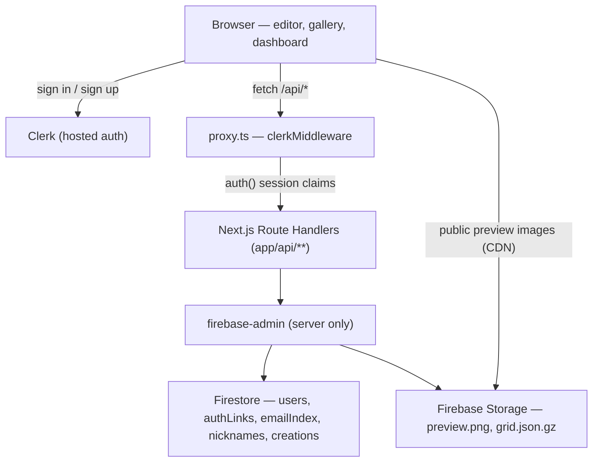
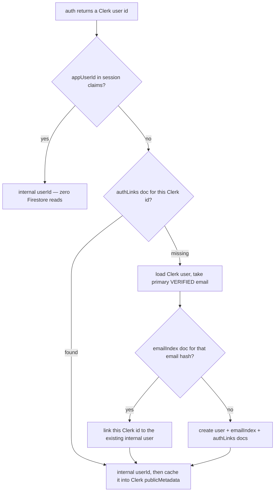

# Minecraft Pixel Art — Socialization Platform

## Phase 1 Goal: the single-user vertical slice

Everything below exists to make these five sentences true, end to end:

1. A user can **create an account**.
2. A user can **generate a pixel art**.
3. A user can **save that pixel art** to the platform.
4. A user can **share a generated pixel art publicly** so it appears in the gallery.
5. A user can **manage their saved pixel arts** (create, read, update, delete).

Public consumption surfaces are included because a "share" that nobody can open is not a share: the **gallery**, the **creation detail page**, and the **public profile page** ship in this phase too.

**Explicitly deferred to later phases:** likes, comments, remix/fork, private slot limits, global stats bar, featured/curated rows, search-by-text, sort-by-popularity.

---

## Current State

**M0 — Complete.** These are done and not to be redone:

- `app/page.tsx` is the landing page; the editor lives at `app/create/page.tsx`.
- `@clerk/nextjs` v7 is installed. `app/layout.tsx` wraps the tree in `<ClerkProvider afterSignOutUrl="/">`.
- `proxy.ts` exists at the repo root running `clerkMiddleware()` with a matcher. **Note:** Next.js 16 renamed `middleware.ts` to `proxy.ts` — never create a `middleware.ts`.
- `app/sign-in/[[...sign-in]]` and `app/sign-up/[[...sign-up]]` render Clerk's `<SignIn>` / `<SignUp>`. The user has already signed up and has a live Clerk account.
- `app/_components/NavBar.tsx` renders `<SignInButton>` / `<UserButton>` (sidebar replaces My Creations for signed-in users), with the Gallery link disabled.
- `app/_lib/tags.ts` exports `AVAILABLE_TAGS` (12 slugs) — tag vocabulary for creations.
- `app/_components/landing/CatalogueSection.tsx` is a skeleton grid behind a frosted "launching soon" overlay.
- `firebase-admin`, `svix`, and `server-only` are installed.
- `app/_lib/server/firebase-admin.ts` exports `getDb()` and `getBucket()` with a `globalThis` singleton.
- Firebase service-account env vars are in `.env.local`; `pnpm verify-firebase` confirms connectivity.
- `next.config.ts` has `images.remotePatterns` for the Firebase Storage host.

**M1 — In progress.** Identity layer: no Firestore user record exists yet for the signed-in Clerk account.

---

## Architecture



**The browser never talks to Firebase directly.** No Firebase client SDK, no Clerk↔Firebase custom-token exchange. Every read and write goes through a Route Handler that calls `auth()` and then the Admin SDK. This is the single most important simplification in this plan:

- Security rules become trivial — deny everything except public read on preview images.
- No `firebase` client package in the bundle (only `firebase-admin` on the server).
- Ownership checks live in one place, in TypeScript, next to the query.

The trade-off is no realtime listeners. Phase 1 has nothing that needs them.

---

## Milestones

Each milestone is independently shippable and leaves the app in a working state.

| # | Name | User-visible outcome |
| --- | --- | --- |
| M0 ✅ | Firebase foundation | Dev infrastructure; no UX change |
| M1 🔄 | Identity layer | Sign-in creates a Firestore user; `GET /api/me` works |
| M2 | Authenticated shell | Sidebar appears after sign-in; nickname claimed at `/onboarding`; `/dashboard` shows empty state |
| M3 | Save a creation | Save button in editor; creation appears in dashboard |
| M4 | Manage creations | Publish/unpublish, edit, delete, re-open in editor |
| M5 | Public surfaces | `/gallery`, `/creations/[id]`, `/u/[nickname]` go live |
| M6 | Hardening | Clerk webhooks; account deletion cascade; seed script |

### What happens after a user signs in (M1 → M2 handoff)

```
Sign in with Clerk
       │
       ▼
first authenticated request hits proxy.ts
       │
       ▼
resolveUser() runs in /api/me or any mutating route
  ├── reads appUserId from JWT claim (fast path, 0 reads after first time)
  ├── or reads /authLinks/{clerkId} (cold path, once per Clerk identity)
  └── or reconciles on verified email → creates /users, /emailIndex, /authLinks
       │
       ▼
Internal userId exists in Firestore
       │
       ▼
nickname === null?
  ├── YES → redirect to /onboarding (only blocks publishing, not saving privately)
  └── NO  → land on /dashboard
```

---

## Authenticated Shell Layout

Applies to `/dashboard` and `/onboarding` only. All other pages keep the existing top `NavBar`.

```
app/(authenticated)/
├── layout.tsx          ← renders AppSidebar + <main> slot
├── dashboard/
│   └── page.tsx
└── onboarding/
    └── page.tsx
```

`AppSidebar` is a fixed left rail (`w-56`, `h-screen`, `sticky top-0`). Contents:

```
┌──────────────────┐
│  mc-pixel  [logo]│  → links to /
├──────────────────┤
│  ✦ Create        │  → /create
│  ☰ My Creations  │  → /dashboard  (active highlight)
│  ◎ Explore       │  → /gallery
├──────────────────┤
│  (spacer, flex-1)│
├──────────────────┤
│  [UserMenu]      │  custom avatar button (see below)
└──────────────────┘
```

- The `<main>` slot gets the remaining width (`flex-1 overflow-y-auto`).
- The sidebar is a Server Component; active-link highlighting and `UserMenu` are extracted into a `"use client"` `SidebarNav` child.
- `/create` is not wrapped in this layout.
- The landing page and public pages keep the top `NavBar`.

---

## UserMenu — custom avatar button

Clerk's `<UserButton>` is **replaced entirely** with a platform-owned `UserMenu` component in both contexts where it appears: the top `NavBar` (public pages) and the sidebar bottom section (`AppSidebar`). The same component handles both via a `variant` prop.

**Why custom instead of Clerk's UserButton:**
- Shows the **platform nickname** (`@nickname`) rather than a Clerk email.
- Fully styled with Tailwind + dark mode, matching the rest of the UI exactly.
- Menu items are ours to define and add to over time.
- Adapts to missing nickname: shows "Set nickname →" instead of a profile link.

### Data sources

`UserMenu` is `"use client"`. It gets everything it needs from two sources with no extra fetch on initial paint:

| Data | Source | When |
| --- | --- | --- |
| Avatar URL, display name | `useUser()` (Clerk, already in bundle) | immediate — already cached |
| Nickname, creation count | `GET /api/me` | fetched once on mount, cached in component state |

The `GET /api/me` call is lightweight (a single Firestore doc read on a warm connection) and is only made when the user is signed in. There is no loading flicker on the avatar itself since that comes from Clerk.

### Anatomy

```
[ avatar img ]  ← 32×32 in NavBar, 36×36 in sidebar
```

Clicking opens a `DropdownMenu` (shadcn `ui/dropdown-menu.tsx`, just added):

```
┌─────────────────────────┐
│ [avatar 40×40]          │
│ Display Name            │
│ @nickname  (or "–")     │
├─────────────────────────┤
│ ◎ My Profile            │ → /u/[nickname]  (hidden if no nickname)
│ ☰ My Creations          │ → /dashboard
│ ✏ Set nickname          │ → /onboarding    (hidden if nickname exists)
├─────────────────────────┤
│ Sign out                │ → useClerk().signOut()
└─────────────────────────┘
```

### NavBar variant (`variant="nav"`)

Replaces the `<Show when="signed-in"><UserButton /></Show>` block. The signed-out state (`<SignInButton>` + CTA) remains unchanged.

### Sidebar variant (`variant="sidebar"`)

Replaces the `[UserButton]` at the bottom of `AppSidebar`. Displayed as a compact row:

```
[ avatar ]  Display Name   ▾
            @nickname
```

Clicking opens the same `DropdownMenu` anchored to the bottom of the rail.

### Sign-out

`useClerk().signOut()` redirects to `/` (already configured via `<ClerkProvider afterSignOutUrl="/">`). No custom redirect logic needed.

### What Clerk's UserButton handled that we now own

- **Avatar display** → `user.imageUrl` from `useUser()`, rendered with `next/image`.
- **Sign-out** → `useClerk().signOut()`.
- **Profile management** → replaced by links to `/onboarding` (nickname/bio) and `/u/[nickname]` (public profile).
- **Security / MFA / connected accounts** → not exposed in phase 1. If needed later, link to Clerk's hosted account page via `user.openUserProfile()` or `<UserProfile />` in a modal.

---

## Identity Model

Clerk user ids are **not portable**. Development and production Clerk instances hold entirely separate user pools, so a `user_2abc…` created against your `pk_test` instance will never resolve against the `pk_live` one. Any domain data keyed on a Clerk id is therefore pinned to a single Clerk instance, and the same Firestore records cannot be shared or moved between local and production.

The fix is to stop conflating three different things that the old plan collapsed into one id:

| concern | identifier | stable? | public? |
| --- | --- | --- | --- |
| "who is holding this session" | Clerk user id | no — per Clerk instance | no |
| "who owns this row" | internal `userId` | forever | no |
| "what do we call them in a URL" | `nickname` | user-changeable | yes |

**Internal `userId`** is generated by the platform (a 21-char nanoid, `usr_` prefixed) the first time a person is seen. It is the *only* identifier that domain data references — `creations.authorId`, Storage path prefixes, and every future likes/comments/forks foreign key. It never changes, is meaningless outside this app, and survives a Clerk instance swap, a Clerk-to-something-else migration, and a Firestore export/import between projects.

**Verified email is the reconciliation key.** When a Clerk session appears that has no auth link yet, the resolver looks up the normalized email. If an internal user already exists with that email, the new Clerk id is linked to it; otherwise a new internal user is created. This is what makes "the same information on my local and production" actually true: sign in locally with `you@example.com` against the dev Clerk instance and in production against the live one, and both sessions resolve to the same internal `userId`, therefore the same creations.

**Nickname is the public handle**, used only for `/u/[nickname]` URLs and display. Emails never appear in a URL — that would leak PII to crawlers, break when the user changes email, and make for miserable share links.

### Resolution flow



The `appUserId` cache is the important optimization: write the internal id into Clerk `publicMetadata` at link time and expose it as a custom session claim in the Clerk dashboard's session-token editor. After the first request, `resolveUser()` reads the id straight off the already-verified JWT and costs **zero Firestore reads**. The `/authLinks` lookup is only the cold path, and the email reconciliation only ever runs once per Clerk identity.

### Security constraint on email linking

Linking on email is an account-takeover vector if done carelessly: an attacker signs up on the dev instance with a victim's address and inherits their data. Two non-negotiable guards:

- **Only ever match on an email Clerk reports as verified** (`emailAddress.verification.status === 'verified'`). If the primary email is unverified, create a fresh internal user and do not reconcile — a later `user.updated` webhook can link it once verification completes.
- **Never link on a secondary or unverified address**, only the primary.

Store the email as `sha256(normalizedEmail)` for the index document id (lowercased, trimmed; Gmail dot/plus normalization deliberately *not* applied, since those are distinct accounts elsewhere). Hashing keeps raw addresses out of document paths while remaining an exact-match lookup. The plaintext email lives in a single field on the user doc, which is the only place it needs to exist.

---

## Data Model

### Firestore

**`/users/{userId}`** — `userId` is the internal nanoid. Platform-owned; a partial mirror of Clerk for display only.

| field | type | notes |
| --- | --- | --- |
| `nickname` | string \| null | unique, lowercase, `[a-z0-9_-]{3,30}`; null until claimed |
| `displayName` | string | seeded from Clerk, user-editable |
| `avatarUrl` | string | from Clerk `imageUrl`, refreshed on sync |
| `email` | string | normalized primary; reconciliation source of truth |
| `emailHash` | string | `sha256(email)`, matches the `/emailIndex` doc id |
| `bio` | string | max 300 chars, empty by default |
| `creationCount` | number | all creations |
| `publicCreationCount` | number | published only |
| `createdAt` / `updatedAt` | Timestamp | |

Note there is **no `clerkUserId` field** on the user doc. The link is one-directional, held in `/authLinks`, so one internal user can accumulate several Clerk identities (dev instance, prod instance, a future re-signup) without any schema change.

**`/authLinks/{clerkUserId}`** — `{ userId, instanceId, linkedAt }`. The Clerk-id → internal-id lookup. `instanceId` records which Clerk instance the id came from, purely for debuggability when the same human has both a dev and a prod row.

**`/emailIndex/{emailHash}`** — `{ userId, updatedAt }`. Enforces one internal user per verified email and powers cross-environment reconciliation.

**`/nicknames/{nickname}`** — `{ userId }`. Enforces uniqueness transactionally and makes `/u/[nickname]` a single document read instead of a query.

**`/creations/{creationId}`** — `creationId` is a generated doc id.

| field | type | notes |
| --- | --- | --- |
| `authorId` | string | **internal `userId`** — never a Clerk id |
| `authorNickname` | string | denormalized for card rendering; may go stale, see below |
| `title` | string | 1–80 chars |
| `titleLowercase` | string | reserved for phase-2 search |
| `description` | string | max 500 chars |
| `tags` | string[] | max 3, validated against `AVAILABLE_TAGS` slugs |
| `visibility` | `"public" \| "private"` | |
| `previewImageUrl` | string | public download URL |
| `previewImagePath` | string | Storage path, needed for delete |
| `gridPath` | string | Storage path to `grid.json.gz` |
| `width` / `height` | number | block dimensions |
| `blockCount` | number | `width * height` |
| `orientation` | `"horizontal" \| "vertical"` | |
| `blockCategories` | string[] | derived from the palette at save time |
| `fillBlockId` | string \| null | editor config |
| `foundation` | `{ enabled, blockId }` | editor config |
| `schematicName` | string | filename stem for the `.litematic` |
| `downloadCount` | number | incremented on detail-page download |
| `publishedAt` | Timestamp \| null | set on first publish, drives gallery ordering |
| `createdAt` / `updatedAt` | Timestamp | |

**Indexes required:** composite on `(visibility, publishedAt desc)` for the gallery, `(visibility, tags array-contains, publishedAt desc)` for tag filtering, and `(authorId, updatedAt desc)` for the dashboard.

### Firebase Storage

```
creations/{userId}/{creationId}/preview.png
creations/{userId}/{creationId}/grid.json.gz
```

`{userId}` here is the internal id, so Storage paths are as portable as the Firestore documents that point at them — a bucket copied between projects stays consistent with its metadata. Namespacing by user also makes "delete everything for this person" a single prefix delete.

---

## The Grid Codec — why no `.litematic` is stored

A `.litematic` is a pure function of `(blockGrid, orientation, schematicName, foundation)`. `generateLitematic()` already runs entirely in the browser. So the platform stores the **inputs**, not the output, and regenerates the file on demand.

This is strictly better than storing the binary: the artifact stays re-openable in the editor, downloads cost zero server compute, and storage stays tiny.

Storing the grid as raw JSON would be wasteful — a 128×128 grid is 16,384 cells, and each `MinecraftBlock` object is ~100 bytes of JSON. Instead, `app/_lib/creation-grid.ts` encodes:

```ts
type EncodedGrid = {
  v: 1;
  width: number;
  height: number;
  palette: string[];   // block ids, e.g. "minecraft:white_concrete"
  data: string;        // base64 of pako.gzip(Uint8Array | Uint16Array of palette indices)
};
```

- Palette of ≤256 distinct blocks uses `Uint8Array`, otherwise `Uint16Array` (recorded in a `bytesPerIndex` field). Real grids rarely exceed 60 distinct blocks.
- A 128×128 grid compresses from ~1.6 MB of naive JSON to typically **1–4 KB**.
- `decodeGrid()` rehydrates `MinecraftBlock[][]` by resolving palette ids against `MINECRAFT_BLOCKS`. Ids that no longer exist in the palette (block data regenerated by `pnpm sync-blocks`) fall back to a placeholder block and surface a non-fatal warning rather than throwing.
- `pako` is already a dependency, used by the NBT writer.

The encoded grid is small enough to inline in Firestore, but it goes to Storage anyway so the 1 MB document limit can never become a ceiling and so gallery list queries stay light.

---

## Preview Thumbnails

The old plan called for `canvas.toDataURL()` on the `PixelArtPreview` canvas. That is the wrong source: that canvas is rendered at the current zoom level with full block textures, so its size depends on UI state and it can be enormous.

Instead, `app/_lib/thumbnail.ts` renders an **independent offscreen canvas** at a fixed scale (4px per block, clamped to a 512px max edge) filling each cell with the block's average color, then `canvas.toBlob('image/png')`. Deterministic, a few tens of KB, and completely decoupled from the preview component's internals.

The thumbnail is generated client-side at save time and uploaded as part of the save request.

---

## Save Pipeline

`POST /api/creations` accepts `multipart/form-data` with three parts: a `metadata` JSON blob, the `preview` PNG, and the `grid` gzipped payload. Multipart keeps it to a single round trip and avoids handing signed upload URLs to the client.

Server-side sequence:

1. `const user = await resolveUser()` → 401 if there is no session; yields the internal `userId`.
2. Validate metadata: title length, description length, tags ⊆ `AVAILABLE_TAGS`, `tags.length <= 3`, dimensions within the editor's allowed range, grid payload under a hard size cap (1 MB gz, 2 MB png). Publishing (`visibility: "public"`) additionally requires `user.nickname` to be set — 409 with code `nickname_required` otherwise, which the client turns into a redirect to `/onboarding`.
3. Allocate `creationId` via `db.collection('creations').doc()`.
4. Upload both files to Storage under `creations/{userId}/{creationId}/`, make `preview.png` publicly readable.
5. Write the creation document (`authorId` = internal `userId`) and increment the user's counters in a batch.
6. Return the created creation.

If step 5 fails, the uploaded objects are deleted before returning the error, so no orphans accumulate.

---

## Editor Integration (`/create`)

Three additive changes to `app/create/page.tsx`. The anonymous download flow is untouched.

### Action bar (signed-in, grid generated)

```
[ ↓ Download ]   [ 🔒 Private · Public 🌐 ]   [ Save ]   … litematic hint …
                       ↑ inline visibility toggle
```

- The **inline visibility toggle** is a two-segment pill: `Private` / `Public`. Its state (`"private" | "public"`) lives in `CreatePage`'s React state, defaulting to `"private"`.
- When a creation is loaded via `?creation=<id>`, the toggle is initialised from the creation's current `visibility` field.
- The **Save button** is next to the toggle. Signed out, it is wrapped in `<SignInButton mode="modal">` so clicking opens the Clerk modal without navigating away and losing the grid. Signed in, it opens `SaveCreationModal`.
- Download remains the leftmost button and is always available to everyone.

**Why inline rather than in the modal:** visibility is a *persistent intent*, not a detail. The user should be able to glance at the bar and know whether their next save will be public or private, without opening a dialog.

### SaveCreationModal (from `/create`)

Built on the existing shadcn `dialog`, `input`, `textarea`, `label`, `badge`, `button` primitives. Fields:

- **Title** — pre-filled from `schematicName`, required, 1–80 chars.
- **Description** — optional textarea, max 500 chars.
- **Tags** — `TagSelect`, max 3 from `AVAILABLE_TAGS`.
- **Visibility summary** — read-only display of the toggle's current value (e.g. "Saving as: Public — will appear in the gallery"). Not editable here; the user closes the modal and changes the toggle if they want to switch. This avoids having two controls for the same thing.

On submit: `encodeGrid()` + `renderThumbnail()` → `POST /api/creations`. If visibility is `"public"` and the user has no nickname, the API returns `409 nickname_required` and the modal surfaces a prompt: "You need a nickname before publishing. [Set one →]" linking to `/onboarding` in a new tab so the editor state is preserved.

### SaveCreationModal (from `/dashboard` — edit mode)

Same component, `mode="edit"` prop. **Does include the visibility toggle** because there is no inline bar in the dashboard context. Saves via `PATCH /api/creations/[id]` — no file re-upload unless the grid changed.

### Loading an existing creation

Via `/create?creation=<id>`. On mount, if the param is present: fetch the creation, `decodeGrid()` → `blockGrid`, restore `orientation` / `fillBlockId` / `foundation` / `schematicName` / `width` / `height`, initialise the visibility toggle from `creation.visibility`, regenerate the litematic. The page holds a `loadedCreationId`; Save becomes PATCH, modal button reads "Update".

The original uploaded image is a blob URL and is never persisted. A creation loaded from the dashboard has no "original" for the compare slider — the compare toggle is already gated on `imagePreviewUrl !== null`, so no change needed.

### Landing page — no authenticated variant

The landing page does not change for signed-in users. The gallery section will naturally surface their published work once M5 ships. No redirect, no hero variant, no banner.

---

## Pages

### `/dashboard` — manage saved creations

Lives inside `app/(authenticated)/dashboard/page.tsx`. Server component; `auth.protect()` at the top. Fetches the signed-in user's creations ordered by `updatedAt desc`. Rendered inside the `AppSidebar` layout.

Renders a responsive grid of `CreationCard` in `owner` variant. Each card carries a visibility badge and an actions menu:

- **Publish / Unpublish** — `PATCH { visibility }`, optimistic toggle, sets `publishedAt` on first publish.
- **Edit details** — reuses `SaveCreationModal` in edit mode for title/description/tags/visibility without re-uploading files.
- **Open in editor** — links to `/create?creation={id}`.
- **Copy link** — only for public creations.
- **Delete** — confirm dialog, then `DELETE`, which removes both Storage objects and the document and decrements counters.

Empty state: a centered message with a "Start Creating →" button to `/create`. Exports `metadata` with `robots: { index: false, follow: false }` — this page must never be indexed.

### `/gallery` — public catalogue

Server component reading public creations directly through the Admin SDK (not through its own API route) for the first page, with a client `LoadMore` component that pages via `GET /api/creations?scope=public&cursor=`.

- Tag filter chips sourced from `AVAILABLE_TAGS`, driven by a `?tag=` search param.
- Ordered by `publishedAt desc`. Sort options beyond newest arrive with the phase-2 counters.
- 24 per page, `startAfter` cursor encoded as the last document's `publishedAt` + id.
- Empty state invites the visitor to be the first to publish.

The landing page's `CatalogueSection` is rewritten to fetch the 6 most recent public creations and link through to `/gallery`, with the frosted "coming soon" overlay removed. It keeps a graceful empty state so the landing page still looks intentional on day one.

### `/creations/[id]` — public detail

- 404 via `notFound()` if the creation is missing, or is private and the viewer is not the owner.
- Renders the preview image (`next/image`, `priority`, descriptive `alt` derived from the title), title, description, tags, dimensions, orientation, author link to `/u/[nickname]`, and published date.
- **Download** is a client component that fetches `grid.json.gz`, decodes it, calls the existing `generateLitematic()` + `downloadLitematic()`, and fires `POST /api/creations/[id]/download` to increment the counter. Anonymous visitors can download — that is the point of publishing.
- A "Remix in editor" link to `/create?creation={id}` is deliberately **not** included in phase 1; forking has attribution semantics that belong with the phase-2 social work.
- `generateMetadata()` supplies title, description, canonical URL, and `openGraph.images` pointing at `previewImageUrl` (1200×630 handled by the OG image being the preview itself with `alt` text) so links unfurl in Discord and Reddit.
- JSON-LD `CreativeWork` script tag per the Next.js `json-ld` guide.
- Private creations viewed by their owner render with `robots: noindex`.

### `/u/[nickname]` — public profile

Looks up `/nicknames/{nickname}` → internal `userId` → `/users/{userId}`, then queries public creations by `authorId`. Shows avatar, display name, bio, join date, public creation count, and the creation grid. `generateMetadata()` per profile. `notFound()` for unknown nicknames.

The email never appears here or anywhere else public — it exists solely as the server-side reconciliation key.

### `/onboarding` — claim a nickname

A small authenticated page with one field. Reached by redirect when a signed-in user has `nickname: null` and tries to publish, and linked from the dashboard. Live availability check against `GET /api/me/nickname-available?value=`, debounced, with the suggested auto-generated nickname pre-filled so the whole thing is one click for anyone who does not care. `noindex`.

Nickname claiming is deliberately **not** a hard gate on sign-up or on saving privately — a user can create an account and save private work without ever picking one. It only blocks publishing, because that is the first moment a public URL and a byline actually need to exist.

---

## API Surface

All handlers live under `app/api/`. Route params are async in Next.js 16 — type context with the generated `RouteContext<'/api/creations/[id]'>` helper and `await ctx.params`.

| Method + path | Auth | Purpose |
| --- | --- | --- |
| `POST /api/creations` | required | Create a creation (multipart) |
| `GET /api/creations` | optional | List: `scope=mine\|public`, `tag`, `cursor`, `limit` |
| `GET /api/creations/[id]` | optional | Read one; private requires ownership |
| `PATCH /api/creations/[id]` | owner | Update title/description/tags/visibility, optionally new grid + preview |
| `DELETE /api/creations/[id]` | owner | Delete document + Storage objects |
| `POST /api/creations/[id]/download` | none | Increment `downloadCount` |
| `GET /api/me` | required | Own profile (internal `userId`, nickname, bio) |
| `PATCH /api/me` | required | Update bio, displayName, claim nickname |
| `GET /api/me/nickname-available` | required | Availability check for the onboarding field |
| `GET /api/users/[nickname]` | none | Public profile + public creations |
| `POST /api/webhooks/clerk` | svix sig | `user.updated` / `user.deleted` sync |

Shared helpers in `app/_lib/server/`:

- `resolveUser()` — session → internal user record, running the link/reconcile flow above. Returns `null` when signed out.
- `requireUser()` — `resolveUser()` or throw a typed 401.
- `requireNickname()` — `requireUser()` plus a 409 `nickname_required` when the nickname is null.
- `requireOwnership(creationId)` — loads the doc, compares `authorId` against the internal `userId`, throws 403/404.
- `jsonError(status, code, message)` — one error envelope for every route, so the client can branch on `code`.

No handler ever reads `auth().userId` directly outside `resolveUser()`. That single choke point is what keeps Clerk ids from leaking back into domain data, and it is worth an ESLint `no-restricted-syntax` rule to enforce.

Route Handlers are uncached by default in Next 16, which is what these need. The gallery's read path is a server component instead, so it can use `use cache` in a later optimization pass without touching the API.

---

## Auth & User Records

Clerk owns authentication. Firestore owns identity. `resolveUser()` in `app/_lib/server/identity.ts` is the bridge, and it is the only code in the app that touches a Clerk id.

**Resolution is lazy, not webhook-driven.** It runs at the top of every authenticated handler, following the flow diagrammed in the identity model: session claim cache, then `/authLinks`, then verified-email reconciliation, then create. This means sign-up works in local development with no webhook tunnel, and there is never a window where a user exists in Clerk but not in Firestore.

**The webhook is a hardening layer, added last.** `POST /api/webhooks/clerk` verifies the `svix` signature and handles:

- `user.updated` — refresh `displayName` / `avatarUrl`; if the primary email changed, move the `/emailIndex` entry to the new hash inside a transaction. If the email only *just* became verified and an internal user already owns that address, link rather than duplicate.
- `user.deleted` — delete `/authLinks/{clerkUserId}` so the identity is unlinked. Whether to also purge the internal user is a policy choice: since the same person may still have a live identity on the other Clerk instance, the safe default is to unlink only, and purge the internal user (creations, Storage prefix, nickname, email index) only when no auth links remain.

That last point is a direct consequence of the multi-instance design and is easy to get wrong — deleting your dev account should not wipe your production gallery.

**Nickname assignment.** On first resolution, generate a candidate from Clerk's `username`, else the email local part, slugified to `[a-z0-9_-]` and truncated to 30; on collision append a short random suffix. This candidate is stored as a *suggestion*, not a claim — `nickname` stays `null` until the user confirms it at `/onboarding`, so nobody ends up permanently branded `john-doe-4f2` without having seen it.

Claiming runs in a Firestore transaction that creates `/nicknames/{new}`, deletes `/nicknames/{old}` if present, and updates the user doc, failing if the new name is taken. Validate against a reserved-word blocklist (`admin`, `api`, `create`, `gallery`, `dashboard`, `onboarding`, `u`, `creations`, `sign-in`, `sign-up`, `me`, `settings`) so a nickname can never shadow a route.

Changing a nickname does **not** rewrite `authorNickname` on existing creations. The detail and profile pages resolve the author's current nickname from `authorId` at render time; `authorNickname` on the creation is a rendering hint for list views only, and may go stale until that creation's next write. The alternative is a fan-out update across every creation, which is not worth it at this scale — and because `authorId` is the internal id, links never break, only the displayed label lags.

### Environment portability

This is the payoff, and the thing to actually verify:

- **Two Firebase projects (recommended).** `mc-pixel-dev` and `mc-pixel-prod`. Internal ids, Storage paths, and every foreign key survive a `gcloud firestore export` / `import` between them, because nothing references a Clerk instance. Seed data authored locally can be promoted to production as-is.
- **One shared Firebase project.** Also works — the dev and prod Clerk identities of the same human reconcile onto one internal user via verified email, so you genuinely see the same creations in both. Be aware this means local development writes into the live gallery; gate it with a `visibility: "private"` default or an `APP_ENV` field filter before doing it.

A `scripts/seed-user.mjs` helper that creates an internal user plus email index from a plain email address makes fixture data reproducible in either setup, with no Clerk account required.

### `proxy.ts`

Extend the existing file with `createRouteMatcher` rather than protecting everything:

- Protected: `/dashboard(.*)`, `/onboarding`, and `POST`/`PATCH`/`DELETE` on `/api/creations(.*)`, `/api/me(.*)`.
- Public: `/`, `/create`, `/gallery`, `/creations/(.*)`, `/u/(.*)`, `GET /api/creations(.*)`, `GET /api/users/(.*)`, `/api/webhooks/(.*)`.

`/create` stays public — anonymous generation and download must keep working exactly as they do today. That non-regression is the acceptance bar for this whole phase.

---

## Security Rules

Because all access is server-side through the Admin SDK (which bypasses rules), the rules exist only to slam the door on direct client access:

```
// Firestore
match /{document=**} { allow read, write: if false; }
```

```
// Storage — preview images are served publicly; grids are fetched by path, not listed
match /creations/{userId}/{creationId}/preview.png { allow read: if true; allow write: if false; }
match /creations/{userId}/{creationId}/grid.json.gz { allow read: if true; allow write: if false; }
match /{allPaths=**} { allow read, write: if false; }
```

Grid payloads are publicly readable by URL, which is correct for public creations and an accepted trade-off for private ones: the path contains an unguessable generated `creationId`, and the content is a block grid, not sensitive data. If private grids ever need real protection, switch the detail page to stream them through `GET /api/creations/[id]/grid` with an ownership check.

---

## SEO Requirements

Per `AGENTS.md` and `.cursor/plans/seo.md`, non-negotiable for this phase:

- Every new page exports `metadata` or `generateMetadata()` with a meaningful title and description.
- `app/sitemap.ts` gains `/gallery` plus dynamically generated entries for every public creation and every profile with at least one public creation. Keep the existing root entry.
- `/dashboard` is `noindex, nofollow`. Private creation detail pages are `noindex`. Nothing else gains a `noindex`.
- `next.config.ts` gains `images.remotePatterns` for the Firebase Storage host so `next/image` can serve previews.
- Preview images use descriptive `alt` (`"Minecraft pixel art: {title}"`) and `priority` on the detail page hero.
- The existing root `metadataBase`, `openGraph`, `twitter`, and `robots` config stays untouched.

---

## New Files

**Libraries**
- `app/_lib/creation.ts` — shared types + validators
- `app/_lib/creation-grid.ts` — grid codec
- `app/_lib/thumbnail.ts` — offscreen PNG renderer
- `app/_lib/server/firebase-admin.ts` ✅ — Admin SDK singleton
- `app/_lib/server/creations.ts` — Firestore queries
- `app/_lib/server/identity.ts` — `resolveUser`, auth linking, email reconciliation, internal id generation
- `app/_lib/server/nicknames.ts` — validation, blocklist, reservation transactions
- `app/_lib/server/auth.ts` — `requireUser`, `requireNickname`, `requireOwnership`, `jsonError`
- `scripts/seed-user.mjs` — create an internal user from an email, no Clerk account needed

**Layout**
- `app/(authenticated)/layout.tsx` — sidebar shell; wraps `/dashboard` and `/onboarding`
- `app/_components/AppSidebar.tsx` — Server Component outer rail
- `app/_components/SidebarNav.tsx` — `"use client"` child; active link highlighting + `UserMenu`

**Auth UI**
- `app/_components/UserMenu.tsx` — `"use client"`; custom avatar button + DropdownMenu; `variant="nav"` (NavBar) and `variant="sidebar"` (AppSidebar); fetches `/api/me` for nickname; calls `useClerk().signOut()` for sign-out; replaces Clerk `<UserButton>` in both contexts

**Components**
- `app/_components/NicknameForm.tsx` — debounced availability check, used by onboarding and dashboard settings
- `app/_components/CreationCard.tsx` — `public` and `owner` variants
- `app/_components/VisibilityPill.tsx` — inline two-segment toggle (Private | Public) used in the /create action bar
- `app/_components/SaveCreationModal.tsx` — create mode (read-only visibility summary) and edit mode (full VisibilityPill)
- `app/_components/TagSelect.tsx` — max-3 tag picker over `AVAILABLE_TAGS`
- `app/_components/DeleteCreationDialog.tsx`
- `app/_components/CreationGrid.tsx` — shared responsive grid + empty state
- `app/_components/DownloadCreationButton.tsx` — client-side regenerate + download

**Pages**
- `app/(authenticated)/dashboard/page.tsx`
- `app/(authenticated)/onboarding/page.tsx`
- `app/gallery/page.tsx`
- `app/creations/[id]/page.tsx`
- `app/u/[nickname]/page.tsx`

**Routes** — as listed in the API surface table.

## Modified Files

- [`app/create/page.tsx`](app/create/page.tsx) — Save button, save modal wiring, `?creation=` hydration
- [`app/_components/NavBar.tsx`](app/_components/NavBar.tsx) — replace `<UserButton>` with `<UserMenu variant="nav" />`, enable Gallery link
- [`app/_components/landing/CatalogueSection.tsx`](app/_components/landing/CatalogueSection.tsx) — real data, overlay removed
- [`app/sitemap.ts`](app/sitemap.ts) — gallery, creations, profiles
- [`next.config.ts`](next.config.ts) — Storage `remotePatterns`
- [`proxy.ts`](proxy.ts) — route matchers
- [`messages/en.json`](messages/en.json), [`messages/es.json`](messages/es.json) — new keys
- [`README.md`](README.md) — Firebase setup + env var documentation

## New Dependencies

- `firebase-admin` ✅ — server-side Firestore + Storage
- `svix` ✅ — Clerk webhook signature verification
- `server-only` ✅ — prevents server libs from being imported in client bundles
- shadcn `dropdown-menu` ✅ — `app/_components/ui/dropdown-menu.tsx` (installed via `pnpm dlx shadcn add dropdown-menu`)

No Firebase **client** SDK. All remaining installs use `pnpm add` on Node `v24.16.0` (`nvm use` first).

## New Environment Variables

```
FIREBASE_PROJECT_ID=
FIREBASE_CLIENT_EMAIL=
FIREBASE_PRIVATE_KEY=            # newlines escaped as \n
FIREBASE_STORAGE_BUCKET=
NEXT_PUBLIC_FIREBASE_STORAGE_HOST=  # for next/image remotePatterns
CLERK_WEBHOOK_SIGNING_SECRET=
```

### Clerk dashboard configuration

One non-code step, easy to forget and silently costly if skipped: in **Clerk → Sessions → Customize session token**, add

```json
{ "appUserId": "{{user.public_metadata.appUserId}}" }
```

Without it everything still works, but every authenticated request pays an extra `/authLinks` read instead of taking the internal id off the JWT. Do this on **both** the development and production instances.

---

## Build Order

Work is grouped into milestones, each independently shippable. Every milestone ends with `pnpm build` passing and the new surface working end-to-end.

| Milestone | Acceptance bar |
| --- | --- |
| M0 ✅ | `pnpm build` passes; `pnpm verify-firebase` goes green |
| M1 | `GET /api/me` returns a JSON user record; Firestore `/users` doc exists for the signed-in Clerk account |
| M2 | Signed-in user sees sidebar; `/onboarding` lets them claim a nickname; `/dashboard` renders its empty state |
| M3 | Save a pixel art from `/create`; creation document + preview image appear in Firebase console; dashboard shows the card |
| M4 | Edit, publish/unpublish, and delete all work from the dashboard; `/create?creation=id` re-opens the editor |
| M5 | Public creation appears in `/gallery`; `/creations/[id]` link works and the OG image unfurls on Discord; `/u/[nickname]` shows the portfolio |
| M6 | Deleting the Clerk account cascades correctly; `pnpm verify-firebase` still green on a fresh clone with only a service account JSON |

M6 (Clerk webhook) is last on purpose — everything functions without it except email-change re-keying and account deletion cleanup.

---

## Non-Regressions to Verify

The anonymous flow is the product's current value proposition and must survive untouched:

- A signed-out visitor can still upload, generate, edit blocks, and download a `.litematic` from `/create` with zero prompts.
- No Clerk or Firebase call blocks the editor's first paint.
- The 3D viewer, undo stack, compare slider, and material list behave identically.
- Landing page Lighthouse scores do not regress from the real gallery data replacing the skeleton.

Plus the portability claim this phase exists to guarantee:

- Signing in locally and in production with the same verified email resolves to one internal `userId`.
- No Clerk id appears in any Firestore document outside `/authLinks`, in any Storage path, or in any URL. Grep for `user_` in a Firestore export as the check.

---

## Later Phases (sketch, not in scope)

- **Phase 2 — Engagement:** likes (`/likes/{userId}_{creationId}`), comments, sort by popularity, text search on `titleLowercase`.
- **Phase 3 — Remix:** fork with `forkOf` attribution, fork counts, "remixed from" lineage.
- **Phase 4 — Growth:** global stats bar backed by a denormalized `/stats/global` counter doc, featured/curated rows, private slot limits with an upgrade path.

---

## Implementation Notes

- **Read `node_modules/next/dist/docs/` before writing code.** This is Next.js 16.2.9 and it differs from training data: `middleware.ts` is now `proxy.ts`, route `params` are promises, `RouteContext<'/path'>` is a generated global type, and Route Handlers are uncached by default.
- **`resolveUser()` is the only place a Clerk id may be read.** Every other module deals in internal `userId`. Any `auth().userId` used as a database key is a bug, not a shortcut — that is the exact mistake this identity model exists to prevent.
- Use **pnpm** on the `.nvmrc` Node version (`v24.16.0`); run `nvm use` first.
- Check for an existing **shadcn/ui** primitive in `app/_components/ui/` before building anything new — `dialog`, `input`, `textarea`, `label`, `badge`, `card`, `separator`, and `button` already exist.
- Local component state and the existing React context providers cover this phase; **do not** reach for Zustand unless dashboard and editor genuinely need to share state.
- Tailwind v4 only, matching the existing dark-mode class conventions (`dark:` variants throughout, `bg-grass` for the brand accent).
- Every user-visible string goes through `next-intl`; add keys to both `en.json` and `es.json` in the same commit.
