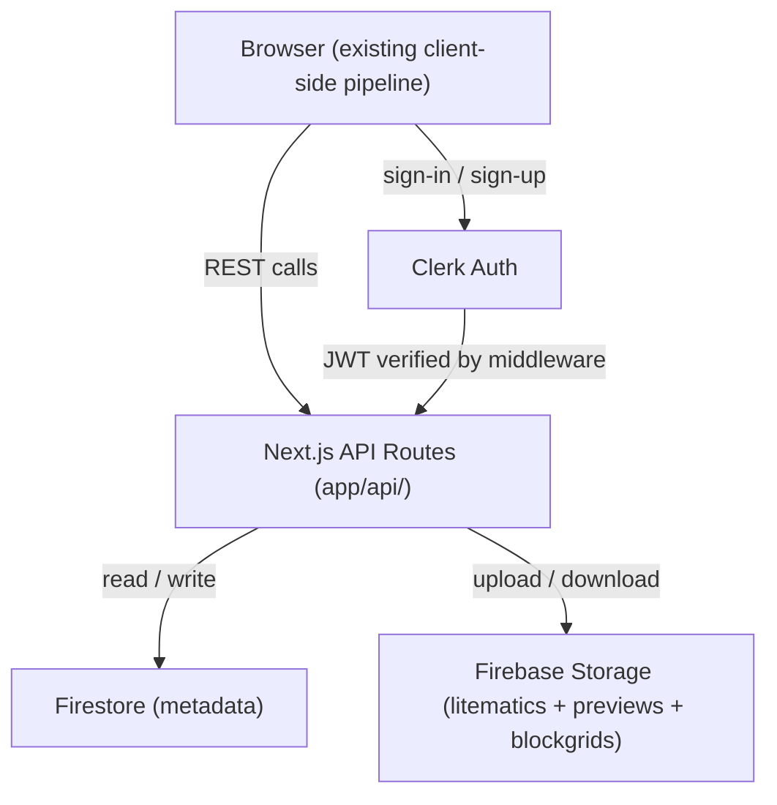

# Minecraft Pixel Art — Socialization Platform

## Architecture Overview

## Routing Reshuffle

The current `app/page.tsx` is the editor. Adding a landing page requires a route move:

- `app/page.tsx` (current editor) → **`app/create/page.tsx`**
- `app/page.tsx` → **new landing page**
- All internal links, analytics `track()` calls, and any redirects that pointed to `/` for the editor must be updated to `/create`

---

## User Flows

### Flow 1 — Discovery & Download (no auth)
`/` → hero CTA → `/explore` → browse public creation cards → `/creations/[id]` → view 2D/3D preview → download `.litematic` freely

### Flow 2 — Create → Download Gate
`/create` → click **Download**:
- **"Download only"** (anonymous) → immediate download, no change to current behavior
- **"Publish & Download"** (requires sign-in) → Clerk sign-in → save creation → download triggered

### Flow 3 — Authenticated Save with Visibility
Signed-in user → `/create` → **"Save"** button in sidebar:
- Dialog: title, description, public/private toggle
- Private slot indicator: `3/10 private slots used`
- On submit → upload preview PNG + blockgrid JSON + `.litematic` to Firebase Storage → write metadata to Firestore

### Flow 4 — Private Limit Enforcement
User at 10/10 private creations → tries to save as private → blocked:
> "You've reached your 10 private creation limit. Publish one or delete one to continue."
→ link to `/dashboard` to manage

### Flow 5 — Remix / Fork
`/creations/[id]` → **"Remix"** button → if unauth: sign-in prompt → loads `blockGrid` + config back into editor at `/create` → save creates new creation with `forkOf` reference + "Remixed from [original]" attribution

### Flow 6 — User Dashboard
`/dashboard` → own creations grid (public + private) → toggle visibility (respects limit), delete, edit (re-loads into `/create` editor), copy share link

### Flow 7 — Profile Pages
`/u/[username]` → public creations, bio, total likes received → anyone can view

### Flow 8 — Return Authenticated Visit
User returns while signed in → soft banner on landing page: "Welcome back! Your saved creations are in [My Creations]" → dashboard link

### Flow 9 — Social Engagement
- Like button (auth required) on cards + creation detail pages
- Comment thread on `/creations/[id]` (auth required to post)
- Fork count + "Remixed from" attribution on forked creations

---

## Landing Page (`/`) — Sections

The existing `app/page.tsx` editor moves to `/create`. The new landing page has:

- **NavBar** — logo, Explore, Create, sign-in/avatar
- **Hero** — headline + tagline, two primary CTAs: "Start Creating" (`/create`) and "Explore Gallery" (`/explore`); background: animated or static pixel art mosaic
- **How It Works** — 3-step visual: Upload image → Auto-convert to blocks → Download schematic
- **Features** — icon cards: color-accurate CIELAB matching, 2D & 3D preview, one-click `.litematic` download, public gallery, open-source block palette
- **Community Preview** — live-fetched grid of the 6 most-liked public creations with a "See all" link to `/explore`
- **Stats Bar** — global counters: total creations published, total downloads, total blocks placed (derived from width × height sum)
- **Footer** — GitHub link, license, Vercel deployment badge

---

## Catalogue Page (`/explore`) — Detail

- **Search bar** — filter by title or author username (Firestore `where` query on `title_lowercase`)
- **Sort controls** — Newest, Most Liked, Most Forked (Firestore `orderBy`)
- **Category filter** — filter by block categories used in a creation (e.g. Wool, Concrete, Terracotta)
- **Creation grid** — responsive CSS grid of `CreationCard` components
  - Each card: preview thumbnail, title, author avatar + username, like count, fork badge (if remixed), block dimensions
- **Pagination** — "Load more" button using Firestore `startAfter` cursor (25 per page)
- **Featured row** — pinned section at the top showing editor-curated or highest-liked creations of the week

---

## Data Model (Firestore)

- `/users/{clerkId}` — username, displayName, avatarUrl, bio, privateCreationCount, totalLikesReceived, createdAt
- `/creations/{creationId}` — authorId, authorUsername, title, titleLowercase, description, isPublic, previewImageUrl, schematicUrl, blockGridUrl, width, height, orientation, blockCategories, likeCount, commentCount, forkCount, forkOf, createdAt, updatedAt
- `/likes/{userId}_{creationId}` — userId, creationId, createdAt
- `/comments/{commentId}` — authorId, authorUsername, creationId, content, createdAt

**Firebase Storage layout:**
- `creations/{creationId}/preview.png` (canvas.toDataURL capture, client-side before upload)
- `creations/{creationId}/schematic.litematic`
- `creations/{creationId}/blockgrid.json` (kept separate due to Firestore 1MB limit)

---

## Pages & Routes Summary

- `/` — new landing page (hero, features, community preview, stats)
- `/create` — editor (moved from `/`; existing `app/page.tsx` logic unchanged)
- `/explore` — public catalogue with search, sort, filter, pagination
- `/creations/[id]` — creation detail: 2D preview, stats, like, comment, fork, download
- `/u/[username]` — user profile: public creations, bio
- `/dashboard` — authenticated: manage own creations
- `/sign-in/[[...sign-in]]` — Clerk sign-in
- `/sign-up/[[...sign-up]]` — Clerk sign-up

**New API routes (`app/api/`):**
- `POST/GET /api/creations`
- `GET/PATCH/DELETE /api/creations/[id]`
- `POST /api/creations/[id]/like`
- `GET/POST /api/creations/[id]/comments`
- `DELETE /api/creations/[id]/comments/[commentId]`
- `POST /api/creations/[id]/fork`
- `GET /api/users/[username]`
- `GET /api/stats` — global counters for landing page stats bar

---

## New Components

- `NavBar.tsx` — logo, Explore/Create links, auth state, avatar, My Creations
- `CreationCard.tsx` — thumbnail, author, like count, fork badge, dimensions
- `SaveCreationModal.tsx` — title, description, visibility toggle, slot counter
- `DownloadGateModal.tsx` — anonymous vs publish options
- `LikeButton.tsx`
- `CommentThread.tsx`
- `ForkButton.tsx`
- `UserAvatar.tsx`
- `StatsBar.tsx` — global counters strip on landing page
- `CommunityPreview.tsx` — 6-card live grid on landing page

---

## Modified Files

- [`app/page.tsx`](app/page.tsx) — replaced with new landing page; editor content moved to `app/create/page.tsx`
- [`app/layout.tsx`](app/layout.tsx) — wrap in `<ClerkProvider>`, add `<NavBar>`
- [`middleware.ts`](middleware.ts) — new file, Clerk `clerkMiddleware()` protecting API routes
- [`next.config.ts`](next.config.ts) — add Firebase Storage image hostname to `remotePatterns`

---

## New Dependencies

- `@clerk/nextjs` — auth
- `firebase` — Firestore + Storage client SDK
- `firebase-admin` — server-side Firestore in API routes

---

## Key Implementation Notes

- **Routing move**: `app/page.tsx` → `app/create/page.tsx` is a file move + update all `href="/"` editor links and analytics `track()` call locations to `/create`
- **Preview generation**: before upload, call `canvas.toDataURL('image/png')` on the existing 2D canvas in `PixelArtPreview` and convert to a `Blob` — no server-side rendering of blocks needed
- **`titleLowercase` field**: stored alongside `title` in Firestore to enable case-insensitive search via `where('titleLowercase', '>=', query)`
- **`blockCategories` field**: array of category strings stored on the creation document, derived from the `allowedBlocks` config at save time, enabling catalogue filtering
- **Firestore security rules**: public creations readable by all; writes require matching `clerkId`; likes and comments require auth
- **OG meta tags** on `/creations/[id]` using `generateMetadata()` (Next.js App Router) so sharing links unfurl on Discord/Reddit with the preview image
- **Pagination** on `/explore` using Firestore `startAfter` cursors (25 per page)
- **`/api/stats`**: aggregates total creation count, total downloads (sum of a `downloadCount` field incremented on each download), and total blocks (sum of `width * height` across all public creations) — consider a denormalized `/stats/global` Firestore document updated via increment to avoid full-collection scans
- Must read `node_modules/next/dist/docs/` for App Router API route and metadata conventions before writing code
