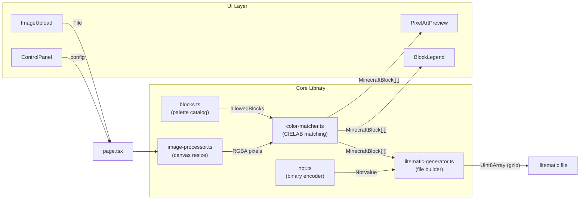

# Minecraft Pixel Art Generator

A browser-based tool that converts any image into a Minecraft pixel art [Litematica](https://www.curseforge.com/minecraft/mc-mods/litematica) schematic (`.litematic`). Upload an image, set your dimensions and orientation, and download a file you can load directly in-game.

---

## Features

- **Image upload** — drag-and-drop or click-to-browse; supports PNG, JPG, WEBP, GIF
- **Custom dimensions** — set exact width × height in blocks (1–512 per axis)
- **Orientation control** — choose between vertical (wall art, XY plane) or horizontal (floor art, XZ plane)
- **Block category filters** — select which block families are allowed in the output (Wool, Concrete, Terracotta, Stone, Wood, Mineral, Nether, and more)
- **Live preview** — zoomable canvas with hover tooltips showing each block's name and ID
- **Block legend** — full inventory sorted by usage count with percentages
- **One-click download** — exports a `.litematic` file compatible with Litematica v6 (Minecraft 1.21.4)
- **Fully client-side** — no server, no uploads; all processing runs in the browser

---

## Architecture



### Data flow summary

| Step | Module | What happens |
|------|--------|--------------|
| 1 | `image-processor` | The uploaded `File` is drawn onto an `OffscreenCanvas` at the target dimensions, producing a raw RGBA `Uint8ClampedArray` |
| 2 | `color-matcher` | Each pixel is converted to CIELAB and matched to the nearest allowed block by Euclidean distance in Lab space |
| 3 | `litematic-generator` | The block grid is encoded as a packed `BigInt64Array`, wrapped in NBT, and compressed with gzip via `pako` |
| 4 | UI | `PixelArtPreview` renders the result to a `<canvas>`; `BlockLegend` shows the inventory; the download button writes the blob |

---

## Project structure

```
minecraft-pixel-art-generator/
├── app/
│   ├── _lib/                         # Core logic (no React)
│   │   ├── blocks.ts                 # Minecraft block palette (~130 blocks, 12 categories)
│   │   ├── color-matcher.ts          # CIELAB perceptual color matching
│   │   ├── image-processor.ts        # Canvas-based image resize and pixel sampling
│   │   ├── nbt.ts                    # Binary NBT encoder
│   │   └── litematic-generator.ts    # .litematic file builder + browser download
│   ├── _components/                  # React UI components
│   │   ├── ImageUpload.tsx           # Drag-and-drop / click-to-browse file picker (label wrapper)
│   │   ├── ControlPanel.tsx          # Dimensions, orientation, category filters, generate CTA
│   │   ├── PixelArtPreview.tsx       # Zoomable canvas preview with tooltips and loading skeleton
│   │   └── BlockLegend.tsx           # Sorted block inventory list
│   ├── page.tsx                      # Main page — step tracker, side-by-side panels, download bar
│   ├── layout.tsx                    # Root layout, metadata, Geist font
│   └── globals.css                   # Tailwind base + global overrides
├── docs/
│   └── features/
│       └── step-by-step-ux.md        # Feature spec: step-by-step UX and output format selection
├── next.config.ts                    # Next.js config (allowedDevOrigins for network access)
├── package.json
├── pnpm-lock.yaml
└── tsconfig.json
```

---

## Key modules

### `app/_lib/blocks.ts` — Block palette catalog

Exports a static array of `MinecraftBlock` records, each with a Minecraft namespaced block ID, display name, representative RGB color, and category string.

```typescript
interface MinecraftBlock {
  id: string;                       // "minecraft:white_wool"
  name: string;                     // "White Wool"
  rgb: [number, number, number];    // [233, 236, 236]
  category: string;                 // "Wool"
}
```

`BLOCK_CATEGORIES` is the deduplicated list of categories derived from `MINECRAFT_BLOCKS`. It drives the filter buttons in `ControlPanel`.

**Block categories and counts:**

| Category | Blocks | Example blocks |
|---|---|---|
| Wool | 16 | white_wool … black_wool |
| Concrete | 16 | white_concrete … black_concrete |
| Terracotta | 17 | terracotta, white_terracotta … black_terracotta |
| Stone | 12 | stone, granite, diorite, andesite, deepslate, calcite … |
| Wood | 11 | oak_planks … warped_planks |
| Natural | 7 | sand, red_sand, gravel, dirt, coarse_dirt, clay, mud |
| Frozen | 4 | snow_block, ice, packed_ice, blue_ice |
| Mineral | 13 | coal_block, iron_block, gold_block, diamond_block … |
| Nether | 13 | netherrack, nether_bricks, blackstone, obsidian … |
| End | 3 | end_stone, purpur_block, end_stone_bricks |
| Nature | 7 | moss_block, sea_lantern, sponge, melon … |
| Decorative | 10 | bricks, sandstone, prismarine, glowstone … |

> RGB values are approximate average face colors; they are not texture-sampled. For higher fidelity, the palette can be extended or replaced with values derived from actual texture data.

---

### `app/_lib/color-matcher.ts` — Perceptual color matching

Maps each image pixel to the nearest Minecraft block using **CIELAB** color space, which better reflects human perception than raw RGB distance.

**Pipeline:**

```
sRGB (0–255)
  → gamma decode (linearize)
  → XYZ (D65 illuminant, standard matrix)
  → CIELAB (L*, a*, b*)
  → Euclidean distance (ΔE CIE76)
```

Key behaviors:
- Block Lab values are pre-computed and cached in a `Map<blockId, [L,a,b]>` on first use, so repeated calls are fast.
- Pixels with alpha < 128 are mapped to a synthetic `minecraft:air` record (skipped in the schematic palette).
- The `allowedBlocks` parameter lets the caller restrict matching to a subset of the palette (controlled by the category filter).

**Exported API:**

| Symbol | Purpose |
|---|---|
| `rgbToLab(r, g, b)` | Convert one sRGB triplet to `[L, a, b]` |
| `findNearestBlock(r, g, b, allowedBlocks?)` | Return the closest `MinecraftBlock` for a single pixel |
| `mapPixelsToBlocks(pixels, width, height, allowedBlocks?)` | Return the full `MinecraftBlock[][]` grid for an RGBA buffer |

---

### `app/_lib/image-processor.ts` — Canvas image resize

Handles loading a `File` object and sampling it at arbitrary dimensions using the browser's 2D canvas API.

- Prefers `OffscreenCanvas` for performance; falls back to a DOM `<canvas>` when unavailable.
- `drawImage` scales the source to the exact target size with no aspect-ratio preservation — what you configure is what you get, and the block grid will match those proportions exactly.
- `URL.createObjectURL` is revoked immediately after the image loads to avoid memory leaks.

**Exported API:**

| Symbol | Purpose |
|---|---|
| `loadAndResizeImage(file, w, h)` | Async; returns `{ pixels: Uint8ClampedArray, width, height }` |
| `renderBlockGridToDataUrl(blockColors, blockSize?)` | Renders an RGB grid to a PNG data URL (utility; not used by the main page) |

---

### `app/_lib/nbt.ts` — Binary NBT encoder

A minimal, encode-only implementation of Minecraft's [Named Binary Tag](https://minecraft.wiki/w/NBT_format) format. Supports all tag types required by Litematica.

**Supported tags:** `TAG_End`, `TAG_Byte`, `TAG_Short`, `TAG_Int`, `TAG_Long`, `TAG_Float`, `TAG_Double`, `TAG_String`, `TAG_List`, `TAG_Compound`, `TAG_Int_Array`, `TAG_Long_Array`.

**Design:**
- `NbtValue` is a TypeScript discriminated union — each tag type is represented as `{ type: TAG.X, value: ... }`.
- `NbtWriter` accumulates `Uint8Array` chunks and concatenates at the end, avoiding repeated reallocations.
- All integers are big-endian as required by the NBT spec.
- Strings are UTF-8 encoded with a 2-byte unsigned length prefix.

**Exported API:**

| Symbol | Purpose |
|---|---|
| `TAG` | Tag type ID constants |
| `NbtValue` | Discriminated union type for all tag payloads |
| `nbtByte / nbtShort / nbtInt / nbtLong / nbtString / nbtIntArray / nbtLongArray / nbtCompound / nbtList` | Constructor helpers |
| `encodeNbt(rootName, compound)` | Serialize a named root compound to `Uint8Array` |

---

### `app/_lib/litematic-generator.ts` — Litematic file builder

Converts the `MinecraftBlock[][]` grid into a complete, valid `.litematic` file.

**File format:** Litematica version 6, `MinecraftDataVersion: 3953` (Minecraft 1.21.4), gzip-compressed NBT via [pako](https://github.com/nodeca/pako).

**Structure:**
```
root (Compound)
├── MinecraftDataVersion: Int
├── Version: Int (6)
├── Metadata: Compound
│   ├── Name, Description, Author: String
│   ├── TimeCreated, TimeModified: Long
│   ├── EnclosingSize: Compound { x, y, z }
│   ├── RegionCount: Int (1)
│   ├── TotalBlocks: Int (non-air count)
│   └── TotalVolume: Int
└── Regions: Compound
    └── PixelArt: Compound
        ├── Position: Compound { x=0, y=0, z=0 }
        ├── Size: Compound { x, y, z }
        ├── BlockStatePalette: List<Compound>
        ├── BlockStates: LongArray  ← packed block indices
        ├── Entities: List (empty)
        ├── TileEntities: List (empty)
        └── PendingBlockTicks: List (empty)
```

**Orientation and coordinate mapping:**

| Orientation | Region size | Coordinate mapping |
|---|---|---|
| `vertical` (wall, XY plane) | `(cols, rows, 1)` | `x=col`, `y=rows−1−row` (row 0 → top), `z=0` |
| `horizontal` (floor, XZ plane) | `(cols, 1, rows)` | `x=col`, `y=0`, `z=row` |

Linear index formula: `y * sizeX * sizeZ + z * sizeX + x`

**Block state bit-packing:**

Litematica stores block palette indices packed into 64-bit longs. Unlike vanilla chunk format, indices never cross long boundaries:

```
bitsPerBlock   = max(2, ceil(log2(paletteSize)))
blocksPerLong  = floor(64 / bitsPerBlock)
longArraySize  = ceil(totalBlocks / blocksPerLong)
```

`minecraft:air` is always palette index 0. All other blocks are appended in first-seen order.

**Exported API:**

| Symbol | Purpose |
|---|---|
| `Orientation` | `"horizontal" \| "vertical"` |
| `generateLitematic(blockGrid, orientation, name?)` | Returns gzip-compressed NBT as `Uint8Array` |
| `downloadLitematic(data, filename?)` | Triggers a browser file download via a blob URL |

---

## Getting started

**Requirements:** Node.js 20.9+, pnpm

```bash
# Install dependencies
pnpm install

# Start the development server
pnpm dev
# → http://localhost:3000

# Type-check and build for production
pnpm build
```

> **Network access note:** Always open the app at `http://localhost:3000` rather than your machine's network IP. Next.js restricts cross-origin WebSocket connections (used for hot reload) by default. If you need to access it from another device on the same network, add your IP to `next.config.ts`:
>
> ```ts
> const nextConfig: NextConfig = {
>   allowedDevOrigins: ["192.168.x.x"],
> };
> ```

---

## In-game usage

1. Install the **[Litematica mod](https://www.curseforge.com/minecraft/mc-mods/litematica)** (requires [Fabric](https://fabricmc.net/) or [Forge](https://files.minecraftforge.net/)) for Minecraft 1.21.4.
2. Place the downloaded `.litematic` file in your `.minecraft/schematics/` folder.
3. In-game, open Litematica with `M` (default) → **Load Schematics** → select the file.
4. Use **Placement** tools to position and place the schematic in your world.

> Tip: use **Easy Place** mode in Litematica to place blocks one-by-one with ghost-block guidance.
