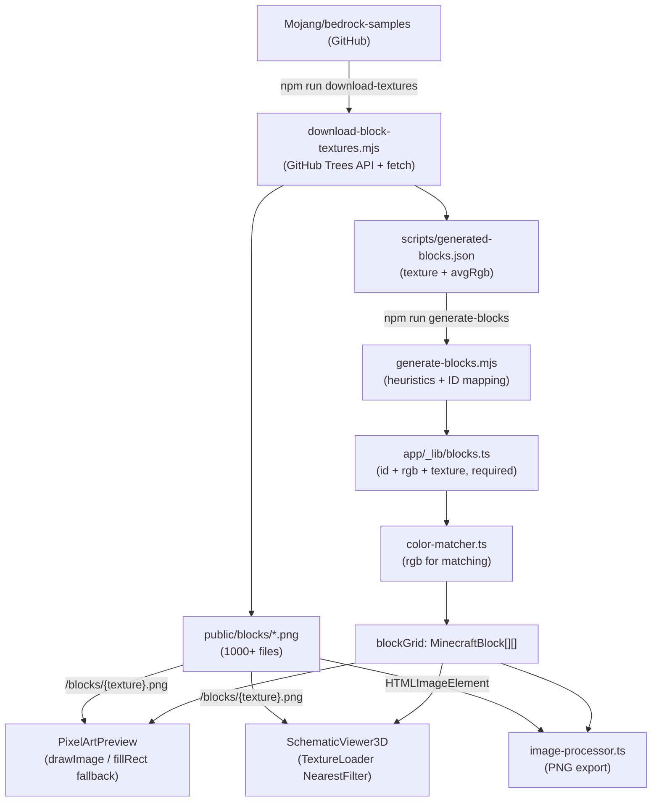

# Block Palette Expansion + Texture Sprites

## Overview

Download all 1000+ block textures from Mojang's bedrock-samples repo, auto-generate a comprehensive block palette from those assets (with RGB computed from pixels), make `texture` a required field, then wire sprites into both the 2D canvas and 3D Three.js previews.

---

## 1. `MinecraftBlock` type — `texture` is required

Change the interface in [`app/_lib/blocks.ts`](../../app/_lib/blocks.ts) to make `texture` a required field:

```ts
export interface MinecraftBlock {
  id: string;
  name: string;
  rgb: [number, number, number];
  category: string;
  texture: string; // Bedrock PNG stem, e.g. "wool_colored_white". "" for synthetic blocks (air).
}
```

Synthetic runtime-only blocks (`minecraft:air`, foundation) carry `texture: ""` as a sentinel; renderers skip texture lookup when the value is empty and fall back to solid color or transparency.

---

## 2. Asset download + block generation script

Two scripts run in sequence via `npm run sync-blocks`:

### `scripts/download-block-textures.mjs` — fetch all assets

1. **Enumerate**: call the GitHub Trees API (`GET /repos/Mojang/bedrock-samples/git/trees/main?recursive=1`) to list every file; filter to paths matching `resource_pack/textures/blocks/*.png` (excludes `.tga`, `.json`, subfolders like `candles/`). This yields 1000+ filenames. Pass `--local` to skip the API call and reprocess files already in `public/blocks/`.
2. **Download**: for each PNG, fetch `https://raw.githubusercontent.com/Mojang/bedrock-samples/main/{path}` and write to `public/blocks/{filename}.png`. Skip if already present (use `--force` to re-download).
3. **Compute stats**: use `sharp` (new dev dependency) to sample each PNG at 16×16 and compute: `avgRgb` (average color), `avgAlpha` (average opacity 0–255), and `variance` (per-channel color spread). Write results to `scripts/generated-blocks.json`.

### `scripts/generate-blocks.mjs` — build the palette

Reads `generated-blocks.json`, applies heuristics to derive block metadata, and writes `app/_lib/blocks.ts`.

**Category heuristics** (by texture filename prefix/suffix):

| Pattern | Category |
|---------|----------|
| `wool_colored_*` | Wool |
| `concrete_*` (not `_powder`) | Concrete |
| `concrete_powder_*` | Concrete Powder |
| `terracotta_*`, `hardened_clay*` | Terracotta |
| `planks_*`, `*_planks`, `*_log*`, `*_wood` | Wood |
| `stone*`, `deepslate*`, `cobblestone*`, `tuff*`, `calcite*` | Stone |
| `sand*`, `dirt*`, `gravel*`, `clay*` | Natural |
| `snow*`, `ice*`, `packed_ice*`, `blue_ice*` | Frozen |
| `*_block` matching ore/mineral names | Mineral |
| `netherrack*`, `nether_*`, `obsidian*`, `basalt*`, `blackstone*`, `crimson_*`, `warped_*` | Nether |
| `end_stone*`, `purpur*` | End |
| `moss*`, `mud*`, `mangrove_*`, `sculk*`, `*_leaves*` | Nature |
| anything else (bricks, glowstone, etc.) | Decorative |

**Name derivation**: replace underscores with spaces, title-case each word (e.g. `wool_colored_white` → `"White Wool"`). A lookup table overrides the generic rule for cases like `hardened_clay` → `"Terracotta"`.

**Filtering** — two-stage:
1. **Alpha filter**: any texture with `avgAlpha < 230` is discarded automatically. This eliminates leaves, wheat, saplings, mushrooms, coral fans, glass panes, and all other partially-transparent non-solid blocks without needing to name them explicitly.
2. **Pattern filter**: a skip-list of name patterns removes remaining non-block textures (directional faces, doors, slabs, stairs, buttons, torches, signs, etc.).

**ID mapping**: derive a `minecraft:` Java Edition ID from the Bedrock texture name using a hand-maintained lookup for cases where naming diverges (e.g. `wool_colored_white` → `minecraft:white_wool`), and a regex fallback for new blocks where Bedrock and Java names align (e.g. `bamboo_planks` → `minecraft:bamboo_planks`).

The script is idempotent — re-run it any time Mojang updates the repo to pull in new blocks.

**New `package.json` scripts:**

```json
"download-textures": "node scripts/download-block-textures.mjs",
"generate-blocks":   "node scripts/generate-blocks.mjs",
"sync-blocks":       "node scripts/download-block-textures.mjs && node scripts/generate-blocks.mjs",
"regen-blocks":      "node scripts/download-block-textures.mjs --local && node scripts/generate-blocks.mjs"
```

`sync-blocks` — full refresh (downloads from GitHub + regenerates palette).  
`regen-blocks` — reprocesses already-downloaded files only (no network, fast).

New dev dependency: `sharp` (for server-side PNG pixel sampling).

---

## 3. 2D preview — `PixelArtPreview.tsx`

Current approach (solid color):

```ts
ctx.fillStyle = `rgb(${r},${g},${b})`;
ctx.fillRect(col * cellSize, row * cellSize, cellSize, cellSize);
```

New approach:

- On `blockGrid` change, preload all unique `block.texture` values into an `imageCache: Map<string, HTMLImageElement>` using `useEffect`
- In the draw loop: if a loaded image exists for the block's texture, call `ctx.drawImage(img, x, y, cellSize, cellSize)`; otherwise fall back to `fillRect` with `block.rgb` (covers loading state and `texture: ""` air blocks)
- `imageRendering: "pixelated"` is already set — 16×16 source PNGs will scale up sharply

---

## 4. 3D preview — `SchematicViewer3D.tsx`

Current approach (per-color `MeshLambertMaterial`):

```ts
const material = new THREE.MeshLambertMaterial({
  color: new THREE.Color(r / 255, g / 255, b / 255),
});
```

New approach:

- Build a `textureCache: Map<string, THREE.Texture>` at component mount using `THREE.TextureLoader`
- Load `/blocks/{block.texture}.png` per unique texture (skip empty string for air)
- Set `magFilter = THREE.NearestFilter` and `minFilter = THREE.NearestFilter` on each texture for pixel-perfect cubes
- Apply as `map` on `MeshLambertMaterial` (keeps ambient/directional lighting shading)
- Fall back to solid-color material for any block whose texture fails to load

---

## 5. PNG export — `image-processor.ts`

`renderBlockGridToDataUrl` currently uses solid color only. Update it to accept an optional `textureMap: Map<string, HTMLImageElement>` parameter and call `drawImage` when an entry exists, preserving the solid-color path for server-side / pre-load contexts.

---

## Data flow after changes



---

## Files changed

| File | Change |
|------|--------|
| `app/_lib/blocks.ts` | `texture` required, full palette auto-generated *(overwritten by script)* |
| `app/_components/PixelArtPreview.tsx` | image cache + `drawImage` |
| `app/_components/SchematicViewer3D.tsx` | `THREE.TextureLoader` + `NearestFilter` |
| `app/_lib/image-processor.ts` | optional texture map in export |
| `scripts/download-block-textures.mjs` | *(new)* enumerate + download + compute RGB |
| `scripts/generate-blocks.mjs` | *(new)* generate `blocks.ts` from JSON |
| `scripts/generated-blocks.json` | *(new, gitignored)* intermediate artifact |
| `package.json` | `sync-blocks` script + `sharp` dev dep |
