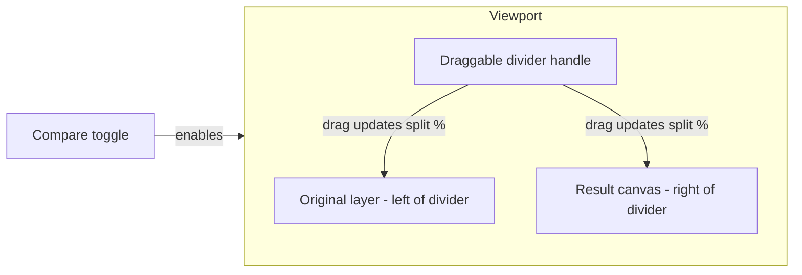

# Feature Spec: Image Comparison Slider

**Status:** Implemented  
**Affected files:** `app/page.tsx`, `app/_components/PixelArtPreview.tsx`, `app/_components/ComparisonDivider.tsx`, `README.md`

**Replaces:** Original image overlay (40% opacity canvas blend) in the 2D preview toolbar.

---

## Implementation Status

| Section | Item | Status |
|---|---|---|
| 1 Motivation | Deprecate opacity overlay | Done |
| 2 UX | Compare toggle in toolbar | Done |
| 2 UX | Draggable before/after divider | Done |
| 2 UX | Keyboard divider control (arrow keys ±5%) | Done |
| 2 UX | Shared pan/zoom for both layers | Done |
| 2 UX | Grid on result layer only | Done |
| 2 UX | Editor mode guardrails (auto-switch to pan) | Done |
| 3 Component API | `ComparisonDivider` component | Done |
| 3 Component API | `compareEnabled` state in `page.tsx` | Done |
| 3 Component API | Remove overlay logic from `drawCanvas()` | Done |
| 4 Analytics | `Compare Toggled` with context properties | Done |
| 4 Analytics | `Compare Split Changed` with drag/keyboard method | Done |
| 5 Docs | Cross-link from `step-by-step-ux.md` | Done |
| 5 Docs | Update `README.md` step 7 | Done |

---

## 1. Motivation

### 1.1 Previous behavior (replaced)

Before this feature, comparison used a **canvas compositing overlay**:

- State: `showOriginalOverlay` in `app/page.tsx` (default `false`)
- Rendering: `drawCanvas()` drew the original image at **40% opacity** on top of block textures
- UI: **Overlay** toolbar button
- Scope: **2D only**

```tsx
// removed from drawCanvas()
if (showOriginalOverlay && overlayImg) {
  ctx.globalAlpha = 0.4;
  ctx.drawImage(overlayImg, 0, 0, canvas.width, canvas.height);
  ctx.globalAlpha = 1;
}
```

### 1.2 Why it was replaced

- Blended overlay made it hard to judge pixel-level fidelity
- Opacity was fixed at 40% with no user control
- Original and result were visually merged rather than directly comparable

### 1.3 Current behavior

A **Compare** mode reveals original vs result via a **draggable vertical divider**. The user drags left/right (or uses arrow keys) to inspect how the generated block art differs from the uploaded source. This follows the standard before/after comparison pattern used in photo editing tools.

---

## 2. UX Spec

### 2.1 Flow diagram



### 2.2 Behavior

| Scenario | Behavior |
|---|---|
| Compare **off** | Result canvas only (same as pre-feature default) |
| Compare **on** | Two aligned layers; divider at 50% by default |
| Drag divider | Moves split 0–100%; pointer capture on handle |
| Keyboard | Focus the divider handle; **←** / **→** adjust split by ±5% |
| Pan / zoom | Both layers share `offset` + `cellSize`; move together |
| Grid | Renders on **result layer only** (not on original) |
| Select / Pick | Disabled while Compare is on; auto-switches to Pan on enable, restores previous mode on disable |
| No upload | Compare button disabled |
| 3D mode | No comparison (unchanged) |
| Loading | Toolbar skeleton shows "Compare" placeholder |
| Re-generate | `compareEnabled` persists across re-generate (no automatic reset) |
| 2D ↔ 3D switch | `compareEnabled` persists; Compare UI only visible in 2D |

### 2.3 Visual layout (Compare on)

```
┌─ Viewport ─────────────────────────────────────┐
│  [Original img]  │  [Result canvas + grid]     │
│                  ↑                              │
│            divider handle (↔ cursor)            │
└─────────────────────────────────────────────────┘
```

- **Left of divider:** original image, stretched to `cols × cellSize`
- **Right of divider:** block-art canvas (grid lines on top when enabled)
- **Handle:** 2px vertical line + circular grip; `cursor: ew-resize`

### 2.4 Interaction matrix

| Compare | Editor mode | Grid | Expected behavior |
|---|---|---|---|
| Off | Pan | Off | Result only; pan + tooltip |
| Off | Pan | On | Result + grid lines |
| On | Pan (forced) | Off | Split view; pan both layers; tooltip on result side only |
| On | Pan (forced) | On | Split view; grid on result side only |
| On | — | — | Select/Pick buttons disabled until Compare is toggled off |

---

## 3. Architecture

### 3.1 Canvas draw path

`drawCanvas()` renders **only** the block grid and optional grid lines. The original image is no longer composited into the result canvas.

A separate `drawOriginalCanvas()` stretches the uploaded image to grid dimensions on a sibling canvas (`imageSmoothingEnabled: false`).

### 3.2 Comparison layer stack

Inside the viewport, canvases are stacked when Compare is enabled:

```tsx
<div ref={viewportRef}>
  <div style={{ position: "absolute", left: offset.x, top: offset.y, width: canvasW, height: canvasH }}>
    {compareEnabled && (
      <canvas ref={originalCanvasRef} style={{ imageRendering: "pixelated", display: "block" }} />
    )}

    <canvas
      ref={canvasRef}
      style={{
        imageRendering: "pixelated",
        display: "block",
        clipPath: compareEnabled ? `inset(0 0 0 ${splitPercent}%)` : undefined,
        position: compareEnabled ? "absolute" : "relative",
        top: 0,
        left: 0,
      }}
    />

    {compareEnabled && (
      <ComparisonDivider
        splitPercent={splitPercent}
        width={canvasW}
        height={canvasH}
        onSplitChange={setSplitPercent}
        onSplitCommit={handleCompareSplitCommit}
      />
    )}
  </div>
</div>
```

- Original canvas sits underneath
- Result canvas is clipped from the left via CSS `clip-path: inset(0 0 0 ${split}%)`
- Split drag is CSS-only (no canvas redraw per frame)

### 3.3 State

| Location | Name | Type | Default | Notes |
|---|---|---|---|---|
| `page.tsx` | `compareEnabled` | `boolean` | `false` | Lifted state; passed to `PixelArtPreview` |
| `PixelArtPreview` | `splitPercent` | `number` | `50` | Internal; reset to 50 when Compare is toggled on |
| `PixelArtPreview` | `originalImgRef` | `HTMLImageElement \| null` | `null` | Loaded from `originalImageUrl` blob |
| `PixelArtPreview` | `previousEditorModeRef` | `EditorMode` | `"pan"` | Saved before Compare forces Pan mode |

---

## 4. Component API

### 4.1 `PixelArtPreview` props

```ts
interface Props {
  blockGrid: MinecraftBlock[][];
  isLoading?: boolean;
  showGrid: boolean;
  onShowGridChange: (v: boolean) => void;
  gridColor: string;
  onGridColorChange: (v: string) => void;
  compareEnabled: boolean;
  onCompareEnabledChange: (v: boolean) => void;
  originalImageUrl: string | null;
  onBlocksReplaced?: (r1, c1, r2, c2, block) => void;
  onBlockPicked?: (block: MinecraftBlock) => void;
  onBlockPainted?: (row, col, block) => void;
}
```

### 4.2 `ComparisonDivider` props

```ts
interface Props {
  splitPercent: number;
  width: number;
  height: number;
  onSplitChange: (percent: number) => void;
  onSplitCommit?: (percent: number, method: "drag" | "keyboard") => void;
}
```

- `onSplitChange` — live visual update during drag or keyboard step
- `onSplitCommit` — fires once per interaction: pointer-up after drag, or each arrow key press
- Accessibility: `role="slider"`, `aria-valuemin/max/now`, `aria-label="Compare original and result"`

---

## 5. Analytics

Events are sent via `@vercel/analytics` `track()`. They replace the previous `"Overlay Toggled"` event.

| Event | Properties | When |
|---|---|---|
| `Compare Toggled` | `enabled`, `cols`, `rows`, `grid_enabled`, `final_split?` | Compare button clicked. `final_split` included only when disabling. |
| `Compare Split Changed` | `split`, `method`, `cols`, `rows` | Divider drag ends (`method: "drag"`) or arrow key pressed (`method: "keyboard"`) |

### Questions each event answers

| Question | Event / property |
|---|---|
| Are users trying Compare? | `Compare Toggled` where `enabled = true` |
| Do they engage beyond toggling? | Count of `Compare Split Changed` |
| How far do they inspect? | Distribution of `split` and `final_split` |
| Drag vs keyboard usage? | `Compare Split Changed.method` |
| Does grid affect comparison? | `Compare Toggled.grid_enabled` |
| Does output size affect usage? | `cols` / `rows` on both events |

**Note:** Because `compareEnabled` persists across re-generate and 2D ↔ 3D switches, `Compare Toggled { enabled: true }` may undercount sessions where Compare was already on. Use `Compare Split Changed` as the signal that Compare was actively used.

---

## 6. Known Limitations

| Limitation | Notes |
|---|---|
| Original aspect ratio | Uploaded image is stretched to grid dimensions (same as the old overlay). Future improvement: match `loadAndResizeImage` sampling. |
| 3D mode | No comparison in 3D viewer |
| State persistence | `compareEnabled` is not reset on re-generate or preview mode switch |
| Silent resume | Returning to 2D with Compare still on does not fire a new toggle event |

---

## 7. Out of Scope

- 3D comparison view
- Configurable overlay opacity slider
- Side-by-side scroll panel (two full-width panels in a horizontally scrollable container)
- Comparison in the pre-generate Original panel

---

## 8. Related Docs

- [Step-by-step UX](./step-by-step-ux.md) — main preview layout; post-generate comparison happens inside `PixelArtPreview` after the Original panel is hidden
- [Block textures and expansion](./block-textures-and-expansion.md) — unrelated to comparison rendering
